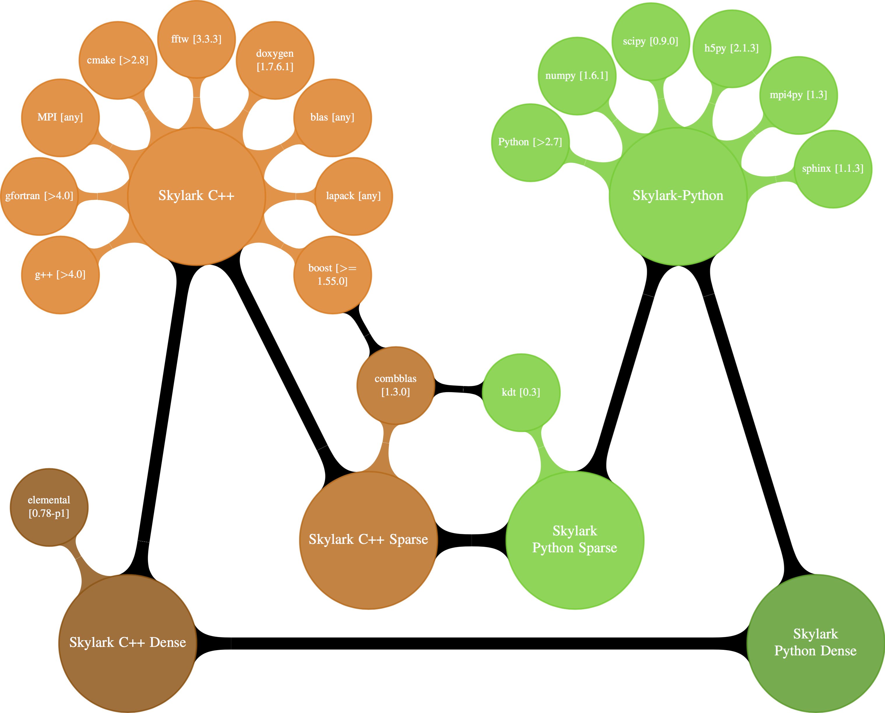

.. highlight:: rst

Building from Source
*********************

Getting the Source Code
========================

The source code is hosted on github. The libSkylark git repository can be
cloned using the following command.

.. code-block:: sh

    git clone https://github.com/xdata-skylark/libskylark.git

libSkylark Software Dependencies
=================================

libSkylark uses several open-source software packages that are essential for its
operation (build, install, and run). In this section, we give instructions to
install these software packages on Ubuntu machines. Installing the required
software packages on other operating systems should be very similar.

We can build libSkylark in one or more of four possible configurations:

    * libSkylark C++ bindings with support for dense (Elemental) matrices skylark-c++-dense
    * libSkylark C++ bindings with support for sparse (CombBLAS) matrices skylark-c++-sparse
    * libSkylark python and C++ bindings with support for dense (Elemental) matrices skylark-python-dense
    * libSkylark python and C++ bindings with support for sparse (CombBLAS) matrices skylark-python-sparse

Please refer to the graph of dependencies for realizing these configurations.
Note that nodes with version information within brackets refer to software
packages while nodes containing no brackets refer to libSkylark build targets.
The versions denote the ones that we have tested with, but apart from Elemental,
CombBLAS, and KDT versions, which need to be strictly followed, other software
(CMake, gfortran, etc) may work just as well with other versions as well.
Orange colored components denote C++ dependencies and the color green is used
for Python dependencies.

.. note::

    On a fresh 64-bit Ubuntu-based (release 14.04 LTS, aka Trusty Tahr) you can
    use the provided bootstrap script ``vagrant/trusty64/boostrap.sh`` to
    install libSkylark dependencies. Before executing the script, be sure to
    set the user name in the UNAME variable at the start of the script.

python-setuptools
------------------

To get easy_install and others.

*Installation*

::

	sudo apt-get install python-setuptools

g++ (>=4.7.1 for Elemental support)
------------------------------------

The C++ compiler in the GNU Compiler Collection (GCC).

*Installation:*

::

	sudo apt-get install g++

In case your ubuntu repository does not contain a GCC/G++ version 4.7 use the following:

::

	sudo add-apt-repository ppa:ubuntu-toolchain-r/test
	sudo apt-get update
	sudo apt-get install gcc-4.7 g++-4.7

and (optionally) use 4.7 as default compiler:

::

	sudo update-alternatives --remove gcc /usr/bin/gcc-4.6
	sudo update-alternatives --install /usr/bin/gcc gcc /usr/bin/gcc-4.7 60 --slave /usr/bin/g++ g++ /usr/bin/g++-4.7
	sudo update-alternatives --install /usr/bin/gcc gcc /usr/bin/gcc-4.6 40 --slave /usr/bin/g++ g++ /usr/bin/g++-4.6

gfortran compiler
------------------

gfortran is the name of the  GNU  Fortran  compiler, which is part of the  GNU Compiler Collection (GCC).

*Installation:*

::

	sudo apt-get install gfortran

CMake (>= 2.8.8 for Elemental support)
---------------------------------------

CMake is a cross-platform free software program managing the build process of
software using a compiler-independent method. It is designed to support
directory hierarchies and applications that depend on multiple libraries, and
for use in conjunction with native build environments such as make.

*Installation:*

::

	sudo apt-get install cmake

If the available version is too old, compile CMake by hand.
Head to http://www.cmake.org/cmake/resources/software.html and download the
latest version.

::

    ./bootstrap --prefix=$CMAKE_INSTALL_DIR
    make
    make install

By specifying a :envvar:`CMAKE_INSTALL_DIR` the install target for CMake can be
set. If no ``--prefix`` is set, CMake will be installed in :file:`/usr/local`.
Make sure to add the install path to your :envvar:`PATH` environment variable.

BLAS and LAPACK
----------------

Basic Linear Algebra Subroutine (BLAS) is a de facto application
programming interface standard for publishing libraries to perform basic
linear algebra operations such as vector and matrix multiplication.
LAPACK (Linear Algebra PACKage) is a software library for numerical linear
algebra. It provides routines systems of linear equations and linear least
squares, eigenvalue problems, and singular value decomposition. It also
includes routines to implement the associated QR, Cholesky and Schur
decomposition.

We provide instructions for using Ubuntu's repository and using OpenBLAS.

*Installation:*

::

	sudo apt-get install libblas-dev libblas-doc libblas3gf liblapack-dev liblapack-doc liblapack3gf

Experiments show good speedups with using OpenBLAS.

::

	wget http://github.com/xianyi/OpenBLAS/tarball/v0.2.8

*Installation (to enable OpenMP support in OpenBLAS):*

::

	make USE_OPENMP=1 FC=gfortran; make install PREFIX=/path/to/install-directory

MPICH2
--------

MPICH is a freely available, portable implementation of MPI, a standard for
message-passing for distributed-memory applications used in parallel
computing. MPICH is free software and is available for most flavors of
Unix-like OS (including Linux).

*Installation:*

::

	sudo apt-get install libcr-dev mpich2 mpich2-doc

NumPy and SciPy
----------------

NumPy is an extension to the Python programming language, adding support
for large, multi-dimensional arrays and matrices, along with a large
library of high-level mathematica functions to operate on these arrays.
SciPy is an open source library of algorithms and mathematical tools for
the Python programming language that grew out of Travis Oliphant's original
collection of extension modules for Python which he released in 1999 under
the name Multipack (named for the netlib packages that it brought together
such as ODEPACK, QUADPACK, and MINPACK).

*Installation:*

::

	sudo apt-get install python-numpy python-scipy

.. note:: Elemental-0.86 requires a NumPy version >= 1.7. On Ubuntu Precise the deb sources only contain version 1.6.x. To upgrade use either:

    ::

    	wget https://launchpad.net/~tukss/+archive/ppa/+build/4055943/+files/python-numpy_1.7.0~b2-1~precise1_amd64.deb
    	sudo dpkg -i python-numpy_1.7.0~b2-1~precise1_amd64.deb

    or

    ::

    	sudo easy_install -U scipy

mpi4py
-------

MPI for Python (mpi4py) provides bindings of the Message Passing Interface
(MPI) standard for the Python programming language, allowing any Python
program to exploit multiple processors.

*Installation:*

::

	sudo easy_install mpi4py

hdf5
----

hdf5 is a portable data model, library and file format for storing and
managing data.

*Installation:*

::

	wget http://www.hdfgroup.org/ftp/HDF5/current/src/hdf5-1.8.12.tar
	tar -xvf hdf5-1.8.12.tar
	cd hdf5-1.8.12
	./configure --enable-cxx --prefix=<location for HDF5 software>
	make >& make.out
	make check >& check.out
	make install

h5py
-----

h5py (h5py) provides Python bindings to hdf5, which is a data model,
library, and file format for storing and managing data.

*Installation:*

::

	sudo apt-get install libhdf5-serial-dev
	sudo easy_install h5py

Boost C++ 1.55.0
-----------------

Boost is a set of libraries for the C++ programming language that provide
support for tasks and structures such as linear algebra, pseudorandom
number generation, multithreading, image processing, regular expressions,
and unit testing.

*Installation:*

::

	wget http://sourceforge.net/projects/boost/files/boost/1.55.0/boost_1_55_0.tar.gz
	tar xvfz boost_1_55_0.tar.gz
	cd boost_1_55_0
	./bootstrap.sh --with-libraries=mpi,serialization,program_options,system,filesystem
	echo "using mpi ;" >> project-config.jam
	./b2 link=static,shared
	sudo ./b2 install

*Compiling with the XL compiler*

This section is inspired by the Argonne Boost configuration. First, as usual
we call bootstrap.

::

	./bootstrap.sh --with-libraries=mpi,serialization,program_options,system,filesystem

In a next step, download :download:`jam file <files/bgq.jam>` and
copy the Boost jam file to ``tools/build/v2/tools/``.
Subsequently, executing

::

	echo "using bgq ;" >> project-config.jam
	echo "using mpi : /bgsys/drivers/ppcfloor/comm/bin/xl/mpixlcxx ;" >> project-config.jam
	./b2 link=static,shared toolset=bgq

compiles the selected boost libraries (you might need to adapt the path to
``mpixlcxx``). In case all versions (debug, mt) are required, use
``--build-type=complete``.

.. note:: Make sure to only use -O2 because -O3 and higher will result in a
    segfault in the compiler for some packages (e.g. :command:`program_options`),
    see http://www-01.ibm.com/support/docview.wss?uid=swg1LI77249.

Elemental 0.86
---------------

Elemental is a framework for distributed-memory dense linear algebra that
strives to be both fast and convenient. It combines ideas including:
element-wise matrix distributions (Hendrickson et al.), object-oriented
submatrix tracking (FLAME, van de Geijn et al.), and first-class matrix
distributions (PLAPACK, van de Geijn et al.).

We support version 0.86. Elemental's API is a moving target, so newer versions
might not work as-is.

.. note:: Currently version 0.86 is not officially released yet. Please,
    use the release candidate, e.g.
    https://github.com/elemental/Elemental/releases/tag/0.86-rc1.

*Installation: (make sure to use a compiler with c++11 support)*

::

        wget https://github.com/elemental/Elemental/releases/tag/0.86-rc1
        unzip 0.86-rc1.zip
        cd Elemental-0.86-rc1/
        rmdir external/metis
        git clone https://github.com/poulson/metis.git external/metis
        mkdir build
        cd build
        cmake -DEL_USE_64BIT_INTS=ON -DCMAKE_BUILD_TYPE=HybridRelease ../
        make
        sudo make install

The installation prefix can be set using the ``CMAKE_INSTALL_PREFIX``.

Note that instead of pulling Metis into the Elemental directory you can set
the Metis path by setting the `METIS_ROOT` environment variable.

If you want to use non-default math libraries specify the ``MATH_LIBS``
variable.
For example for OpenBLAS, run cmake along the following lines:

::

        cmake -D MATH_LIBS="-L/usr/local/lib -llapack -lopenblas -lm" ..

.. note:: Note that the cmake comamnd above may require additional options for
    non-standard Python installations, e.g. Anaconda,
    ``-D  PYTHON_LIBRARY=/path/to/libpython2.7.so  -D PYTHON_INCLUDE_DIR=/path/to/include/python2.7``

Combinatorial BLAS (CombBLAS) 1.4
----------------------------------

The Combinatorial BLAS is an extensible distributed-memory parallel graph
library offering a small but powerful set of linear algebra primitives
specifically targeting graph analytics. We use it in libSkylark to represent
sparse matrices.

*Installation:*

::

	wget http://gauss.cs.ucsb.edu/~aydin/CombBLAS_FILES/CombBLAS_beta_14_0.tgz
	tar xvfz CombBLAS_beta_14_0.tgz
	cd CombBLAS/
	cmake .
	make

*Shared Libs*

In order to use libSkylark through Python, make sure to compile and append the
directory containing the ``*.so`` files to your :envvar:`LD_LIBRARY_PATH`.

::

	cd CombBLAS/
	rm CMakeCache.txt
	cmake -DBUILD_SHARED_LIBS:BOOL=ON .
	make

KDT
----

The Knowledge Discovery Toolbox (KDT) provides a Python interface (amongst
other things) to CombBLAS. libSkylark requires this package to handle sparse
matrices through the Python interface.

To install kdt you need python and python-dev libs:

::

	sudo apt-get install python
	sudo apt-get install python-dev

Head over to http://kdt.sourceforge.net/wiki/index.php/Download and
download kdt-0.3.tar.gz. Then execute:

::

	tar xzf kdt-0.3.tar.gz
	cd kdt-0.3
	export CC=mpicxx
	export CXX=mpicxx
	python setup.py build
	sudo python setup.py install

See http://kdt.sourceforge.net/wiki/index.php/Installation for further
information.

FFTW 3.3.3
-----------

FFTW is a C subroutine library for computing the discrete Fourier transform
(DFT) in one or more dimensions, of arbitrary input size, and of both real and
complex data (as well as of even/odd data, i.e. the discrete cosine/sine
transforms or DCT/DST).

*Installation:*

::

	wget http://www.fftw.org/fftw-3.3.3.tar.gz
	tar xvfz fftw-3.3.3.tar.gz
	cd fftw-3.3.3/
	./configure --enable-shared
	make -j4
	sudo make install

Random123 1.08
---------------

Random123 is a library of "counter-based" random number generators
(CBRNGs). We use them in libSkylark to generate independent random number
streams.

*Installation:*

::

	wget http://www.thesalmons.org/john/random123/releases/1.08/Random123-1.08.tar.gz
	tar xvfz Random123-1.08.tar.gz
	sudo cp -r Random123-1.08/include/Random123 /usr/local/include

Doxygen
--------

Doxygen is a documentation generator, a tool for writing software reference
documentation. The documentation is written within code, and is thus
relatively easy to keep up to date. Doxygen can cross reference
documentation and code, so that the reader of a document can easily refer
to the actual code.

*Installation:*

::

	sudo apt-get install doxygen

Graphviz
----------

Graphviz (short for Graph Visualization Software) is a package of
open-source tools initiated by AT&T Labs Research for drawing graphs
specified in DOT language scripts.

*Installation:*

::

	sudo apt-get install graphviz

.. _build-libskylark-label:

Building libSkylark
====================

libSkylark uses Cmake as a build system. Before you start please make
sure to check out the Section "Installing software dependencies for
libSkylark" to learn about the required dependencies.

**Quick guide**: In many situation the default configuration and settings
should work out of the box. To that end execute

::

	cd $BUILD_DIR
	CC=mpicc CXX=mpicxx cmake $SRC_DIR
	make
	make install

.. note:: If you have MPI compilers in your PATH environment variable, CMake
    may overwrite the compiler specified in the CXX flag.

.. note:: If you want to specify the path for BLAS and/or LAPACK (e.g. use OpenBLAS), define
    the BLAS_LIBRARIES and LAPACK_LIBRARIES enviroment variable.

In case you have a more specific setup or this does not work on your
machine continue reading the next sections.

Python only user-level installation
-----------------------------------
In case you do not have root access, and are satisfied with an Python only
installation, you can install the Python package only at user-level.

::

	cd $BUILD_DIR
	CC=mpicc CXX=mpicxx cmake $SRC_DIR
	make
	cd python-skylark
        python ./setup.py install --user

The Python package will be installed under :file:`~/.local`. The directory :file:`~/.local/lib` should
be in the library load path for the installation to function properly.

Directory setup
----------------

For the rest of this section let's keep the following conventions:

    * the source code is checked out and :envvar:`$SRC_DIR` points to the base directory in the libSkylark repository, e.g.

	::

		export SRC_DIR=/home/user/workspace/libskylark

    * you created a **separate** (do not build in the $SRC_DIR$) build directory :envvar:`$BUILD_DIR` that is used to generate object files, libraries and executables, e.g.

	::

		export BUILD_DIR=/home/user/build/libskylark

Build options
--------------

libSkylark accepts build options in order to customize components. The
following table summarizes all currently available build options:

================ =========== ==========================================================================================
Name             Default     Description
================ =========== ==========================================================================================
USE_FFTW          ON          Build with fftw support
USE_COMBBLAS      OFF         Build with CombBLAS sparse matrix support
USE_PROFILER      OFF         Build with internal profiler
USE_HYBRID        OFF         Build in hybrid mode OpenMP and MPI (if Elemental was compiled in hybrid mode, activate)
BUILD_PYTHON      ON          Build Python interface
BUILD_EXAMPLES    ON          Build libSkylark examples (see examples directory)
BUILD_ML          ON          Build libSkylark with machine learning solvers Build type
================ =========== ==========================================================================================

You can specify the desired build type with ``-DCMAKE_BUILD_TYPE=STRING``,
where ``STRING`` is any of

================ =======
Name             Flags
================ =======
RELWITHDEBINFO   -O3 -g
RELEASE          -O3
DEBUG            -O0 -g
================ =======

The default is RELWITHDEBINFO.

Environment variables
----------------------

The installation of libSkylark can be influenced with two variables:

    * the CMake parameter ``CMAKE_INSTALL_PREFIX`` (i.e. pass ``-DCMAKE_INSTALL_PREFIX=/home/user/software`` when calling :command:`cmake`), and
    * the environment variable :envvar:`$PYTHON_SITE_PACKAGES` to determine the installation location for python packages. Don't forget to adapt the :envvar:`$PYTHONPATH` environment variable as well. Example: If :envvar:`$PYTHON_SITE_PACKAGES` is set to :file:`/home/user/local`, CMake will install the Python bindings under :file:`/home/user/local/lib/python2.7/site-packages/skylark`. At this point, you will have to append :envvar:`$PYTHONPATH` with :file:`/home/user/local/lib/python2.7/site-packages`!

To help CMake to locate installed dependencies (system-wide installed dependencies should be found automatically), you should set the following environment variables:

====================== =============================================================================
Name                   Description
====================== =============================================================================
ELEMENTAL_ROOT         Looks for headers in :envvar:`$ELEMENTAL_ROOT`/include and libs in :envvar:`$ELEMENTAL_ROOT`/lib
COMBBLAS_ROOT          Looks for headers in :envvar:`$COMBBLAS_ROOT`/ and libs in :envvar:`$COMBBLAS_ROOT`/lib
FTW_ROOT               Looks for headers in :envvar:`$FFTW_ROOT`/include and libs in :envvar:`$FFTW_ROOT`/lib
BOOST_ROOT             For non system-wide boost installations
RANDOM123_ROOT         Looks for headers in :envvar:`$RANDOM_123_ROOT`/include
HDF5_ROOT              Looks for headers in :envvar:`$HDF5_ROOT`/include and libs in :envvar:`$HDF5_ROOT`/lib
====================== =============================================================================

Configuring, compiling and installing libSkylark
------------------------------------------------

Finally we are ready to configure, compile and install libSkylark. The default configuration (compiling Elemental and Python
support, installed system-wide) can be compiled and installed with:

::

	cd $BUILD_DIR
	CC=mpicc CXX=mpicxx cmake $SRC_DIR
	make
	make install

.. note:: If you have MPI compilers in your PATH CMake will use the most generic
    (e.g. :command:`mpicxx`) version
    (see https://github.com/Kitware/CMake/blob/master/Modules/FindMPI.cmake#L113).
    This may overwrite the compiler specified in the CXX flag.

The Python packages will most likely be installed under
:file:`/usr/lib/pythonX.Y/dist-packages` (OS and version dependent). Check the
configure output for more details about default installation paths on your machine.

For the sake of illustration let's assume you want to enable CombBLAS support
and install everything in :file:`~/local`:

::

	cd $BUILD_DIR
	export PYTHON_SITE_PACKAGES=~/local/
	CC=mpicc CXX=mpicxx cmake -DCMAKE_INSTALL_PREFIX=~/local -DWITH_COMBBLAS=ON $SRC_DIR
	make
	make install

Notice that we set the :envvar:`PYTHON_SITE_PACKAGES` and passed a
``CMAKE_INSTALL_PREFIX`` to the :command:`cmake` command above. Additionally we
enabled CombBLAS support. Note that you have to make sure that the required
libraries are compiled and the environment variables correctly point to the
installation locations (i.e. ``export COMBBLAS_ROOT=~/software/combblas/``).

.. note:: If a specific linking type wants to be enforced, check out the CMake
    variable ``CMAKE_FIND_LIBRARY_SUFFIXES`` (e.g. use
    ``SET(CMAKE_FIND_LIBRARY_SUFFIXES ".so"``).

Code documentation Doxygen
---------------------------

To generate the documentation (see dependency section for Doxygen installation), run

::

	cd $BUILD_DIR
	make doc

This will generate the Doxygen documentation under :file:`$BUILD_DIR/Documentation`.
To read the documentation open :file:`$BUILD_DIR/Documentation/html/index.html` in a browser.

Sphinx
-------

Make sure to install the Sphinx dependencies before you run make sphinx-doc:

.. code-block:: sh

    apt-get install python-sphinx
    cd /tmp
    svn co https://svn.code.sf.net/p/matplotlib/code/trunk/sampledoc_tut
    mkdir $HOME/.sphinx_ext
    cp sampledoc_tut/sphinxext/*.py $HOME/.sphinx_ext
    rm -rf /tmp/sampledoc_tut

    export SPHINXEXT=$HOME/.sphinx_ext

.. note:: Sphinx requires some dependencies, e.g. plots and latex equations.

    .. code-block:: sh

        apt-get python-dateutil
        apt-get libfreetype6-dev libpng-dev
        easy-install matplotlib
        apt-get install texlive-latex-base
        apt-get install texlive-latex-extra

Then run

.. code-block:: sh

    cd $BUILD_DIR
    make sphinx-doc

and point your browser to :file:`$BUILD_DIR/Documentation/sphinx/index.html`.

Testing
-----------

In order to run unit tests, execute

::

	cd $BUILD_DIR
	make test

Running examples
-----------------

There are two examples in the example folder (for more see python-skylark).
The elemental.cpp shows how C++ code can utilize libSkylark. Run

::

	examples/elemental -help

in the :envvar:`$BUILD_DIR` to get a list of available command line options.

Using libSkylark in Your Project
================================

If you plan to use libSkylark as a library in your project, the following steps
are necessary to build and link your application:

    * add the include path of all libSkylark headers: :file:`${SKYLARK_INSTALL_DIR}/include` (if configured with ``-DCMAKE_INSTALL_PREFIX=${SKYLARK_INSTALL_DIR}``,
    * link against all external libraries used when building libSkylark (take a look and maybe reuse the find modules in :file:`${SRC_DIR}/CMakeModules`:
        * FFTW: fftw3.h
        * Elemental: header files, libEl, libpmrrr
        * CombBLAS: header files, libMPITypelib, libCommGridlib, libMemoryPoollib
        * Random123: threefry.h, MicroURNG.hpp
        * HDF5: hdf5.h, libhdf5, libhdf5_cpp
        * HDFS: hdfs.h, libhdfs, libjvm

Using Cmake
-------------

If you are using Cmake to build your application you can use the CMake
configuration file
:file:`${SKYLARK_INSTALL_DIR}/lib/cmake/SKYLARK/SKYLARKConfig.cmake` in your
``CMakeLists.txt`` to find ``SKYLARK``. After that you can simply
include ``${SKYLARK_INCLUDE_DIRS}`` and ``${SKYLARK_LIBRARIES}`` when you
build and link your application. A very basic CMake file for your project could
look like:

::

	cmake_minimum_required (VERSION 2.8.2)
	project (SAMPLE)

        find_package (MPI REQUIRED)
        set (CMAKE_CXX_COMPILER ${MPI_COMPILER})

	find_package (SKYLARK REQUIRED HINT ${SKYLARK_INSTALL_DIR}/lib)

	include_directories ( ${SKYLARK_INCLUDE_DIRS} )
	add_definitions(${SKYLARK_DEFS})

	add_executable(ex_code ex_code.cpp)
	target_link_libraries(ex_code ${SKYLARK_LIBRARIES} )
	set_target_properties(ex_code PROPERTIES COMPILE_FLAGS "${SKYLARK_CXX_FLAGS}" )

This will pull all the required libs and add all include paths for libSkylark and
its dependencies. You should be able to compile
your application painless by following the above recipe.

Using XYZ Build System
-----------------------

Take a look at the file in :file:`${SKYLARK_INSTALL_DIR}/lib/SKYLARK/SKYLARKConfig.cmake`
to see which include directories libraries you have to include when using libSkylark.

Software Pitfalls
====================

CombBLAS Installation Notes
-----------------------------

The general steps to use CombBLAS with libSkylark:

    * Download KDT, build and install the python package (generated with SWIG), then
    * Download CombBLAS, build and install libs and include files, and finally
    * When configuring libSkylark, use ``-DWITH_COMBBLAS=ON`` in the CMake configure call

**Issues with CombBLAS >= 1.4.0**

Unfortunately there are some issues when using CombBLAS with libSkylark. Check
the subsections below if you have problem compiling or linking CombBLAS.

**UINT32_MAX not declared**

Additionally a CombBLAS header causes the compiler to produce an error
(``UINT32_MAX not declared``). There are two possible ways to fix that:

    * Edit the header (RefGen21.h) and replace ``UINT32_MAX`` with ``std::numeric_limits<unit32_t>::max()``, or
    * add the ``-D__STDC_LIMIT_MACROS`` compile flag in the CMake file when CombBLAS is enabled.

**Compiler Warning: *enumeral* and *non-enumeral* type in conditional expression**

To fix the following warning (appearing when compiling with ``-Werror``):

::

    CombBLAS_beta_13_0/psort-1.0/driver/MersenneTwister.h: In member function ‘void MTRand::seed(MTRand::uint32*, MTRand::uint32)’:
    CombBLAS_beta_13_0/psort-1.0/driver/MersenneTwister.h:234:42: error: enumeral and non-enumeral type in conditional expression [-Werror]

apply the following patch:

::

	diff --git a/psort-1.0/driver/MersenneTwister.h b/psort-1.0/driver/MersenneTwister.h
	index 16e6458..1363423 100644
	--- a/psort-1.0/driver/MersenneTwister.h
	+++ b/psort-1.0/driver/MersenneTwister.h
	@@ -231,7 +231,7 @@ inline void MTRand::seed( uint32 *const bigSeed, const uint32 seedLength )
        	initialize(19650218UL);
       		register int i = 1;
        	register uint32 j = 0;
	-       register int k = ( N > seedLength ? N : seedLength );
	+       register int k = ( static_cast<uint32>(N) > seedLength ? static_cast<uint32>(N) : seedLength );
        	for( ; k; --k )
        	{
                	state[i] =

.. note:: This should be fixed upstream in the next CombBLAS release (most likely 1.3.1).

**Compiling Skylark/CombBLAS with CLANG**

To be able to compile and link using the CLANG compiler (>=3.0.x), the
following patch has to be applied to CombBLAS (<= 1.3.0):

::

	diff --git a/DistEdgeList.cpp b/DistEdgeList.cpp
	index 5ae9301..61cf16f 100644
	--- a/DistEdgeList.cpp
	+++ b/DistEdgeList.cpp
	@@ -102,7 +102,7 @@ void DistEdgeList<IT>::Dump64bit(string filename)
        	MPI_Comm_rank(World, &rank);
        	MPI_Comm_size(World, &nprocs);
        	MPI_File thefile;
	-       MPI_File_open(World, filename.c_str(), MPI_MODE_CREATE | MPI_MODE_WRONLY, MPI_INFO_NULL, &thefile);
	+       MPI_File_open(World, const_cast<char*>(filename.c_str()), MPI_MODE_CREATE | MPI_MODE_WRONLY, MPI_INFO_NULL, &thefile);

        	IT * prelens = new IT[nprocs];
        	prelens[rank] = 2*nedges;
	@@ -125,7 +125,7 @@ void DistEdgeList<IT>::Dump32bit(string filename)
        	MPI_Comm_rank(World, &rank);
        	MPI_Comm_size(World, &nprocs);
        	MPI_File thefile;
	-       MPI_File_open(World, filename.c_str(), MPI_MODE_CREATE | MPI_MODE_WRONLY, MPI_INFO_NULL, &thefile);
	+       MPI_File_open(World, const_cast<char*>(filename.c_str()), MPI_MODE_CREATE | MPI_MODE_WRONLY, MPI_INFO_NULL, &thefile);

        	IT * prelens = new IT[nprocs];
        	prelens[rank] = 2*nedges;
	diff --git a/SpParMat.cpp b/SpParMat.cpp
	index ca553e8..2ef88d6 100644
	--- a/SpParMat.cpp
	+++ b/SpParMat.cpp
	@@ -109,7 +109,7 @@ void SpParMat< IT,NT,DER >::Dump(string filename) const
        	int nprocs = commGrid->GetSize();

        	MPI_File thefile;
	-       MPI_File_open(World, filename.c_str(), MPI_MODE_CREATE | MPI_MODE_WRONLY, MPI_INFO_NULL, &thefile);
	+       MPI_File_open(World, const_cast<char*>(filename.c_str()), MPI_MODE_CREATE | MPI_MODE_WRONLY, MPI_INFO_NULL, &thefile);

        	int rankinrow = commGrid->GetRankInProcRow();
        	int rankincol = commGrid->GetRankInProcCol();

.. note:: The issues in the above patch were addressed (source lines
    commented) in the 1.4.0 CombBLAS release (January 2014).

**Warning: variable ‘XYZ’ set but not used**

CombBLAS (<=1.4.0) has set but not used variables. To remove the warning apply
the following patch.

::

	diff --git a/SpMat.cpp b/SpMat.cpp
	index d00f37c..6ae6050 100644
	--- a/SpMat.cpp
	+++ b/SpMat.cpp
	@@ -108,27 +108,28 @@ SpTuples<IU, NUO> * MultiplyReturnTuples
                                        bool clearA = false, bool clearB = false)

 	{
	-       IU A_m, A_n, B_m, B_n;
	+       //IU A_m, A_n, B_m, B_n;
	+       IU A_n, B_m;

        	if(isAT)
        	{
	-              	A_m = A.getncol();
	+               //A_m = A.getncol();
                	A_n = A.getnrow();
        	}
        	else
        	{
	-               A_m = A.getnrow();
	+               //A_m = A.getnrow();
                	A_n = A.getncol();
        	}
        	if(isBT)
        	{
                	B_m = B.getncol();
	-               B_n = B.getnrow();
	+               //B_n = B.getnrow();
        	}
        	else
        	{
               		B_m = B.getnrow();
	-               B_n = B.getncol();
        +               //B_n = B.getncol();
        	}

         	if(A_n == B_m)

**Disable KDT Log**

To disable the KDT log use the following patch:

::

	diff --git a/kdt/Graph.py b/kdt/Graph.py
	index 51c55b2..e61e9cf 100644
	--- a/kdt/Graph.py
	+++ b/kdt/Graph.py
	@@ -1,7 +1,7 @@
	 import math
	 #import numpy as np # Adam: TRY TO AVOID THIS IF AT ALL POSSIBLE.
 	import pyCombBLAS as pcb
	-import feedback
	+#import feedback
 	import UFget as uf

 	from Util import info, master, version, revision
	diff --git a/kdt/Vec.py b/kdt/Vec.py
	index 00b7c1c..50aaa73 100644
	--- a/kdt/Vec.py
	+++ b/kdt/Vec.py
	@@ -1,6 +1,6 @@
 	import math
 	import kdt.pyCombBLAS as pcb
	-import feedback
	+#import feedback
 	import UFget as uf
 	import Mat as Mat
 	import ctypes
	diff --git a/kdt/__init__.py b/kdt/__init__.py
	index 7f0992f..6c3a10f 100644
	--- a/kdt/__init__.py
	+++ b/kdt/__init__.py
	@@ -10,7 +10,7 @@ from Vec import Vec
 	from Mat import Mat
 	#from SpVec import SpVec, info
 	#from DeVec import DeVec
	-from feedback import sendFeedback
	+#from feedback import sendFeedback
 	from UFget import UFget, UFdownload
 	try:
        	import kdt.pyCombBLAS as pcb
	diff --git a/setup.py b/setup.py
	index a2813e3..10f5bdf 100644
	--- a/setup.py
	+++ b/setup.py
	@@ -369,7 +369,7 @@ pyCombBLAS_ext = Extension('kdt._pyCombBLAS',
        	extra_link_args = extra_link_args, extra_compile_args = extra_compile_args,
        	define_macros=[('GRAPH_GENERATOR_SEQ', '1')] + headerDefs + define_macros)

	-py_modules = ['kdt.pyCombBLAS', 'kdt.Graph', 'kdt.DiGraph', 'kdt.HyGraph', 'kdt.feedback', 'kdt.UFget', 'kdt.Mat', 'kdt.Vec', 'kdt.ObjMethods', 'kdt.Algorithms', 'kdt.Util', 'kdt.SpectralClustering', 'kdt.eig']
	+py_modules = ['kdt.pyCombBLAS', 'kdt.Graph', 'kdt.DiGraph', 'kdt.HyGraph', 'kdt.UFget', 'kdt.Mat', 'kdt.Vec', 'kdt.ObjMethods', 'kdt.Algorithms', 'kdt.Util', 'kdt.SpectralClustering', 'kdt.eig']
 	# SEJITS modules:
 	py_modules.extend(['kdt.specializer.__init__', 'kdt.specializer.parsetab', 'kdt.specializer.pcb_function', 'kdt.specializer.pcb_function_frontend', 'kdt.specializer.pcb_function_sm', 'kdt.specializer.pcb_operator_convert', 'kdt.specializer.pcb_predicate', 'kdt.specializer.pcb_predicate_frontend', 'kdt.specializer.pcb_predicate_sm'])

Issues with CombBLAS < 1.4.0
-----------------------------

**std:: namespace clash (CombBLAS <= 1.3.0)**

Depending on your compiler version (and if you installed CombBLAS <= 1.3.0)
you might need to apply the following patch:

::

    diff --git a/psort-1.0/src/psort_merge.h b/psort-1.0/src/psort_merge.h
    index 858580b..256c3db 100644
    --- a/psort-1.0/src/psort_merge.h
    +++ b/psort-1.0/src/psort_merge.h
    @@ -163,11 +163,11 @@ namespace vpsort {
			out, comp);
	   } else if (locs[next] == 0) {
	    // 10 => backwards out of place
    -       std::merge (reverse_iterator<_RandomAccessIter> (in + disps[nproc]),
    -                   reverse_iterator<_RandomAccessIter> (in + disps[next]),
    -                   reverse_iterator<_RandomAccessIter> (out + disps[next]),
    -                   reverse_iterator<_RandomAccessIter> (out),
    -                   reverse_iterator<_RandomAccessIter> (out + disps[nproc]),
    +       std::merge (std::reverse_iterator<_RandomAccessIter> (in + disps[nproc]),
    +                   std::reverse_iterator<_RandomAccessIter> (in + disps[next]),
    +                   std::reverse_iterator<_RandomAccessIter> (out + disps[next]),
    +                   std::reverse_iterator<_RandomAccessIter> (out),
    +                   std::reverse_iterator<_RandomAccessIter> (out + disps[nproc]),
			not2 (comp));
	   } else {
	    // 11 => in-place

.. note:: This was fixed upstream in the 1.4.0 CombBLAS release (January 2014).

Complete BGQ Installation Instructions
=======================================

This is an end-to-end guide for installing libSkylark on a BG/Q. During this
section we assume the following:

* most of the software and sources are installed in `$HOME/local`,
* the installation of Random123 is omitted (just untar the library)

LLVM/Clang
----------

Because of various dependencies and `c++11` compatibility issues the
installation requires a `c++11` compiler. For this we are installing LLVM/Clang
(until the XL compiler provides the necessary `c++11` features.

Argonne provides rpm packages for the BG/Q. Download and follow the
instructions as stated on https://trac.alcf.anl.gov/projects/llvm-bgq.

There is a fairly painless way to install nightly builds using these
installation scripts https://github.com/sloede/install-bgq.

After this step we assume you have installed LLVM/CLANG under `$HOME/bgclang/`.

Elemental
---------

Download elemental 0.83 (http://libelemental.org/pub/releases/elemental-0.83.tgz).
Then use the following toolchain file (e.g. save to `BGQ-toolchain.cmake`)

.. code-block:: cmake

    set(GCC_ROOT  "/bgsys/drivers/ppcfloor/gnu-linux")
    set(GCC_NAME  "powerpc64-bgq-linux")
    set(CLANG_ROOT "$ENV{HOME}/bgclang/bin")
    set(CLANG_MPI_ROOT "$ENV{HOME}/bgclang/mpi/bgclang")
    set(IBMCMP_ROOT "$ENV{IBM_MAIN_DIR}")

    set(BLAS_LIB "$ENV{HOME}/src/lapack-3.5.0/")
    set(LAPACK_LIB "$ENV{HOME}/src/lapack-3.5.0/")
    set(ESSL_LIB "/opt/ibmmath/lib64")

    set(MPI_ROOT   "/bgsys/drivers/ppcfloor/comm/gcc")
    set(PAMI_ROOT  "/bgsys/drivers/ppcfloor/comm/sys")
    set(SPI_ROOT   "/bgsys/drivers/ppcfloor/spi")

    # The serial compilers
    set(CMAKE_C_COMPILER   "${CLANG_MPI_ROOT}/bin/mpiclang")
    set(CMAKE_CXX_COMPILER "${CLANG_MPI_ROOT}/bin/mpiclang++11")
    set(CMAKE_Fortran_COMPILER "${GCC_ROOT}/bin/${GCC_NAME}-gfortran")

    # The MPI wrappers for the C and C++ compilers
    set(MPI_C_COMPILER   "${CLANG_MPI_ROOT}/bin/mpiclang")
    set(MPI_CXX_COMPILER "${CLANG_MPI_ROOT}/bin/mpiclang++11")

    set(MPI_C_COMPILE_FLAGS    "")
    set(MPI_CXX_COMPILE_FLAGS  "")
    set(MPI_C_INCLUDE_PATH     "${MPI_ROOT}/include")
    set(MPI_CXX_INCLUDE_PATH   "${MPI_ROOT}/include")
    set(MPI_C_LINK_FLAGS       "-L${MPI_ROOT}/lib -L${PAMI_ROOT}/lib -L${SPI_ROOT}/lib")
    set(MPI_CXX_LINK_FLAGS     "${MPI_C_LINK_FLAGS}")
    set(MPI_C_LIBRARIES       "${MPI_C_LINK_FLAGS}   -lSPI -lSPI_cnk -lrt -lpthread -lstdc++ -lpthread")
    set(MPI_CXX_LIBRARIES     "${MPI_CXX_LINK_FLAGS} ${MPI_C_LIBRARIES}")

    if(CMAKE_BUILD_TYPE MATCHES PureDebug OR
    CMAKE_BUILD_TYPE MATCHES HybridDebug)
    set(CXX_FLAGS "-g")
    else()
    set(CXX_FLAGS "-O3")
    endif()

    set(CMAKE_THREAD_LIBS_INIT "-fopenmp")
    set(OpenMP_CXX_FLAGS "-fopenmp")

    ##############################################################

    # set the search path for the environment coming with the compiler
    # and a directory where you can install your own compiled software
    set(CMAKE_FIND_ROOT_PATH
        /bgsys/drivers/ppcfloor
        /bgsys/drivers/ppcfloor/spi
        $ENV{HOME}/bgclang/mpi/bgclang
    )

    # adjust the default behaviour of the FIND_XXX() commands:
    # search headers and libraries in the target environment, search
    # programs in the host environment
    set(CMAKE_FIND_ROOT_PATH_MODE_PROGRAM NEVER)
    set(CMAKE_FIND_ROOT_PATH_MODE_LIBRARY ONLY)
    set(CMAKE_FIND_ROOT_PATH_MODE_INCLUDE ONLY)

    ##############################################################

    set(XLF_LIB "/opt/ibmcmp/xlf/bg/14.1/bglib64")
    set(XLSMP_LIB "/opt/ibmcmp/xlsmp/bg/3.1/bglib64")
    if(CMAKE_BUILD_TYPE MATCHES PureDebug OR
    CMAKE_BUILD_TYPE MATCHES PureRelease)
    set(MATH_LIBS "-L${ESSL_LIB} -lesslbg -L${LAPACK_LIB} -llapack -L${ESSL_LIB} -lesslbg -L${XLF_LIB} -lxlf90_r -L${XLSMP_LIB} -lxlomp_ser -lxlopt -lxlfmath -lxl -lpthread -ldl -Wl,--allow-multiple-definition")
    else()
    set(MATH_LIBS "-L${ESSL_LIB} -lesslsmpbg -L${LAPACK_LIB} -llapack -L${ESSL_LIB} -lesslsmpbg -L${XLF_LIB} -lxlf90_r -L${XLSMP_LIB} -lxlsmp -lxlopt -lxlfmath -lxl -lpthread -ldl -Wl,--allow-multiple-definition")
    endif()

This toolchain file is based on the (Elemental) provided
`BGQ-Mira-clang-essl.cmake` file.
Finally, run the following to compile (and install) Elemental.

.. code-block:: sh

    rm -rf CMake*; \
    cmake -DCMAKE_TOOLCHAIN_FILE=BGQ-toolchain.cmake \
        -DCMAKE_INSTALL_PREFIX=$HOME/local \
        -DCMAKE_BUILD_TYPE=HybridRelease -DEL_EXAMPLES=OFF \
        -DBUILD_SHARED_LIBS=OFF \
        -DEL_USE_64BIT_INTS=ON -DBUILD_METIS=OFF ..
    make install

In case you run into errors or problems, check the `CMakeFiles/CMakeError.log`
file in the build directory.

.. note:: It seems that the `HybridDebug` version is causing problems on the BGQ.

CombBLAS
--------

Download http://gauss.cs.ucsb.edu/~aydin/CombBLAS_FILES/CombBLAS_beta_14_0.tgz
untar and change to the CombBLAS directory.

First we need to fix the CombBLAS `CMakeLists.txt` by commenting out the
following two lines:

.. code-block:: cmake

    #SET(CMAKE_CXX_COMPILER mpicxx)
    #SET(CMAKE_C_COMPILER mpicc)

and then run to build the required libraries

.. code-block:: sh

    CC=$HOME/bgclang/mpi/bgclang/bin/mpiclang \
    CXX=$HOME/bgclang/mpi/bgclang/bin/mpiclang++11 \
    cmake .

.. note:: The examples and test might fail to compile but that's ok for now.

FFTW
----

Download http://www.fftw.org/fftw-3.3.3.tar.gz.

.. code-block:: sh

    CC=$HOME/bgclang/mpi/bgclang/bin/mpiclang \
    CXX=$HOME/bgclang/mpi/bgclang/bin/mpiclang++11 \
    ./configure
    make

Boost
-----

Download Boost 1.55.0, untar, change directory and then execute:

.. code-block:: sh

    ./bootstrap.sh --with-libraries=mpi,serialization,program_options
    echo "using mpi : $HOME/bgclang/mpi/bgclang/bin/mpiclang++11 ;" >> project-config.jam
    ./b2 toolset=clang

.. note:: for this to work make sure that ``clang++`` is in your PATH.

HDF5
----

Make sure you have a compiled libz around then run:

.. code-block:: bash

    CC=$HOME/bgclang/mpi/bgclang/bin/mpiclang \
    CXX=$HOME/bgclang/mpi/bgclang/bin/mpiclang++11 \
    ./configure --enable-cxx --prefix=$HOME/local/ \
        --with-pic --disable-shared --with-zlib=$HOME/local/

    make lib
    make install

.. note:: Building the tests fails, but that should be ok for now.

libSkylark
----------

Finally we can turn to building libSkylark. First change the CMake file by
applying the following patch:

.. code-block:: diff

    diff --git a/CMakeLists.txt b/CMakeLists.txt
    index ef18fa7..825dbaa 100644
    --- a/CMakeLists.txt
    +++ b/CMakeLists.txt
    @@ -81,11 +81,14 @@ if ("${CMAKE_CXX_COMPILER_ID}" STREQUAL "Clang")
        )

        set (COMPILER_SPEC_FLAGS
    -        "-W -Wall -Wno-write-strings -Wno-strict-aliasing -Wno-format -Wno-deprecated -Wno-unused-variable -Wno-unused-parameter -Wno-sign-compare"
    +        "-W -Wall -Wno-write-strings -Wno-strict-aliasing -Wno-format -Wno-deprecated -Wno-unused-variable -Wno-unused-parameter -Wno-sign-compare -Wno-overloaded-virtual -Wno-unsupported-friend"
        )

        #set (LINK_FLAGS
        #)

        set (CMAKE_LIB_LINKER_FLAGS  "${CMAKE_LIB_LINKER_FLAGS} -fPIC")

    @@ -157,7 +160,7 @@ include_directories (${CMAKE_SOURCE_DIR})
    # dependent packages
    # 1. Find MPI --- we are not adding any include directories here because we
    # will be using the mpi compilers, which adds these libraries by default.
    -find_package (MPI REQUIRED)
    +find_package (MPI)
    set (CMAKE_CXX_COMPILER ${MPI_COMPILER})

Make sure that the following environment variables (adapt if necessary) are
exported

.. code-block:: sh

    # LAPACK library
    export LAPACK_LIB=$HOME/src/lapack-3.5.0/

    # root installation dir of CLANG compiler
    export CLANG_ROOT=$HOME/bgclang/

    # dependencies
    export FFTW_ROOT=$HOME/local/fftw-3.3.3/
    export HDF5_ROOT=$HOME/local
    export ELEMENTAL_ROOT=$HOME/local
    export COMBBLAS_ROOT=$HOME/src/CombBLAS
    export RANDOM123_ROOT=$HOME/local/Random123-1.08
    export BOOST_ROOT=$HOME/local/boost_1_55_0

and compile with:

.. code-block:: sh

    mkdir build; cd build
    rm CMakeCache.txt
    rm -rf CMakeFiles

    cmake -DCMAKE_TOOLCHAIN_FILE=../CMake/toolchains/BGQ-clang-essl.cmake \
          -DUSE_FFTW=ON -DUSE_COMBBLAS=ON -DBUILD_PYTHON=OFF -DUSE_HYBRID=ON \
          ../

.. note:: If you get a ``undefined reference to vtable for std::nested_exception``
          error this hints that you most likely are missing the gcc 4.7.2 toolchain
          (libc++). The missing files and instructions to patch the wrapper
          scripts are provided on the ANL trac page (see top).

For compiling the ``async`` example driver you need the following patch (the
OpenMP statement seems to crash the CLANG compiler):

.. code-block:: diff

    diff --git a/algorithms/asynch/AsyRGS.hpp b/algorithms/asynch/AsyRGS.hpp
    index 92158f1..5eadf94 100644
    --- a/algorithms/asynch/AsyRGS.hpp
    +++ b/algorithms/asynch/AsyRGS.hpp
    @@ -180,7 +180,7 @@ int AsyRGS(const base::sparse_matrix_t<T1>& A, const El::Matrix<T2>& B,
                 utility::random_samples_array_t<dtype> stepidxs =
                     context.allocate_random_samples_array(sweeps * n, distribution);

    -#           pragma omp parallel for default(shared) private(j, d)
    +//#           pragma omp parallel for default(shared) private(j, d)
                 for(j = 0; j < sweeps * n ; j++)
                     internal::jstep(colptr, rowind, vals, Bd, Xd, k, d, stepidxs[j]);

SLURM
-----

On Watson Q the following SLURM script can be used to run examples:

.. code-block:: bash

    #!/bin/bash
    RUN_DIR=$HOME/work/libskylark/build
    RUN_EXE=examples/elemental

    if [ -z "$SLURM_JOBID" ]; then
        sbatch --gid=`hostname -s` --time=10:00 --nodes=8 --ntasks-per-node=2  -O --qos=umax-8 $0
    else
        srun  --chdir=$RUN_DIR \
            --output=elemental.out \
            --error=error.out \
            $RUN_EXE
    fi

which outputs

.. code-block:: sh

    # cat error.out

    # cat elemental.out
    Default
    0.558572 -0.316131 -0.0357262 0.572592 0.142264
    -0.149105 0.0597079 0.228256 -0.53152 -0.0828558
    -0.201294 0.499321 0.397655 0.6972 -0.303714
    -0.36505 -0.120876 -0.276908 -0.461459 -0.255837
    -0.154734 -0.0392899 0.202231 -0.298655 -0.262944

